# NanoTwitchLeafs 4 – Screenshots

## Deutsch

Die folgenden Aufnahmen zeigen NanoTwitchLeafs 4 im dunklen und hellen Darstellungsmodus. Personenbezogene Angaben, lokale Pfade, Kanalnamen und Seriennummern wurden für die Veröffentlichung unkenntlich gemacht. Nur in den Trigger-Aufnahmen bleiben die Gerätenamen sichtbar, damit die Auswahl mehrerer Zielgeräte erkennbar ist.

| Ansicht | Dunkel | Hell |
| --- | --- | --- |
| Chat / Konsole | 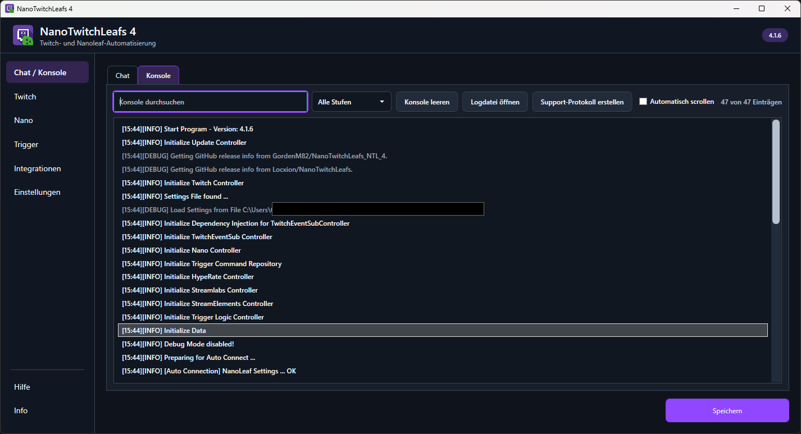 | 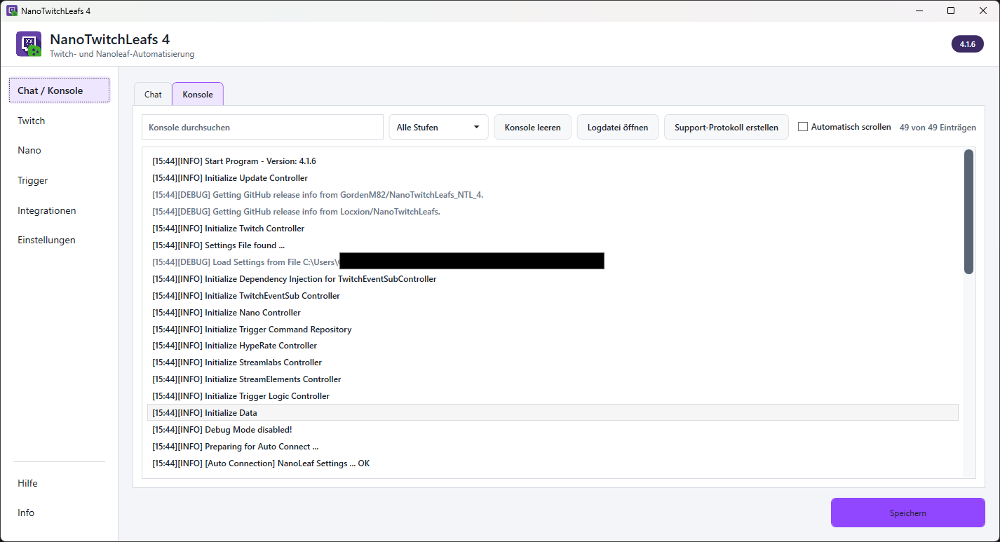 |
| Twitch | 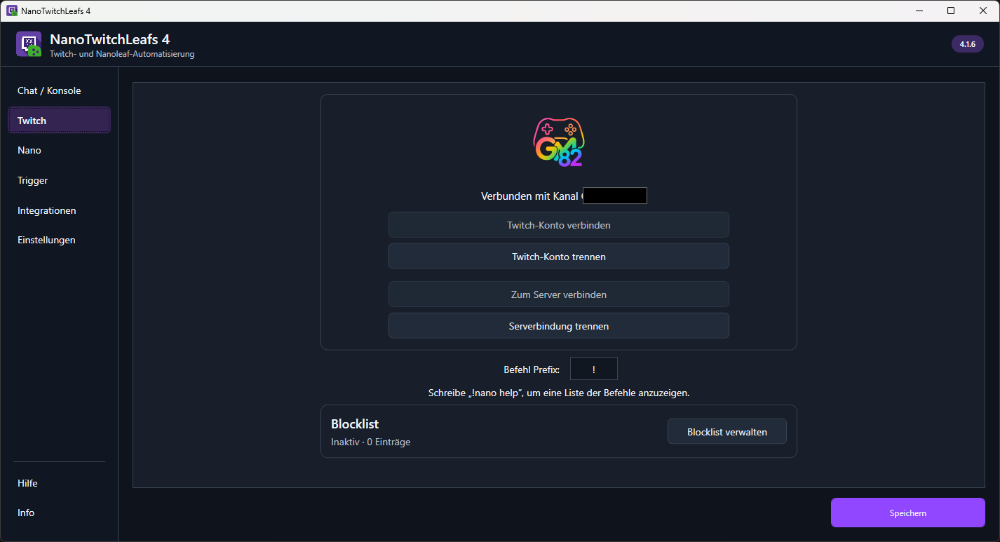 | 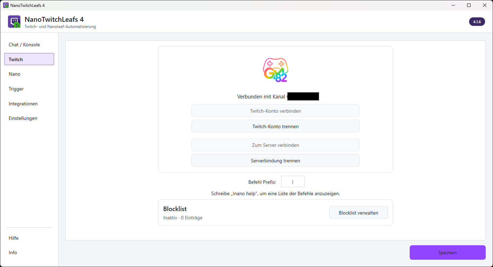 |
| Nanoleaf | 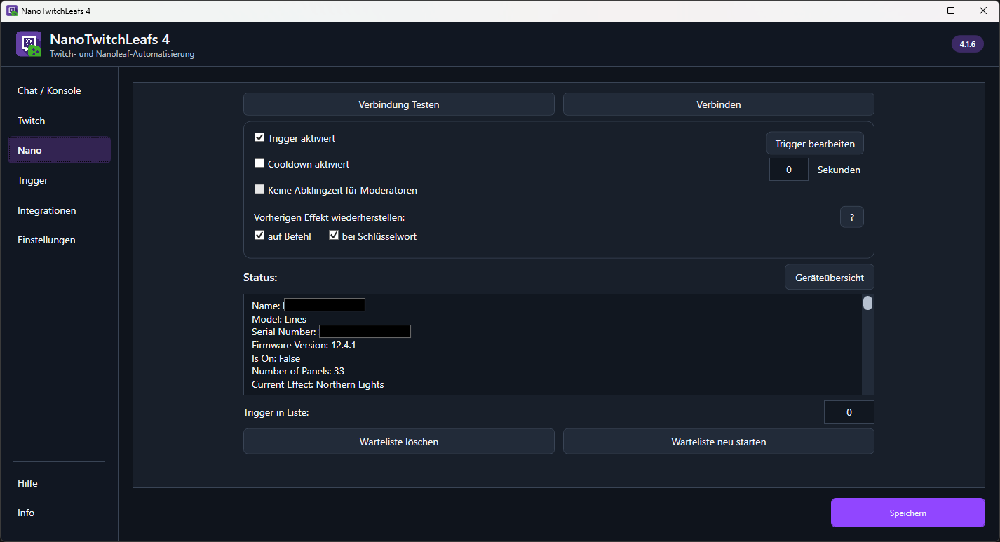 | 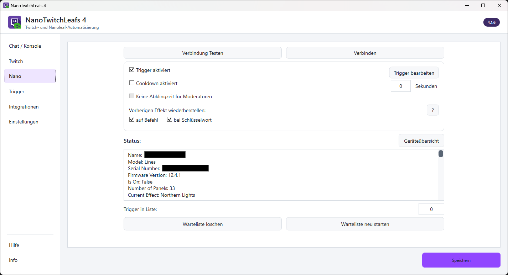 |
| Trigger | 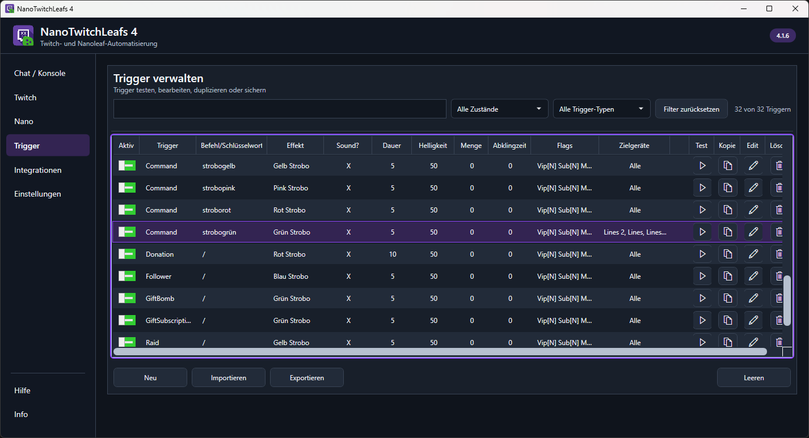 | 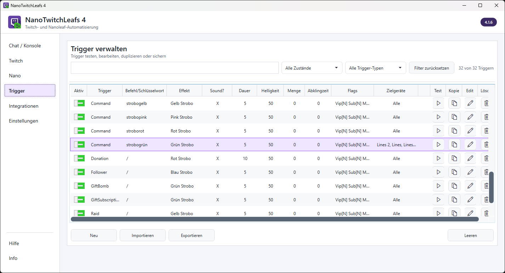 |
| Integrationen | 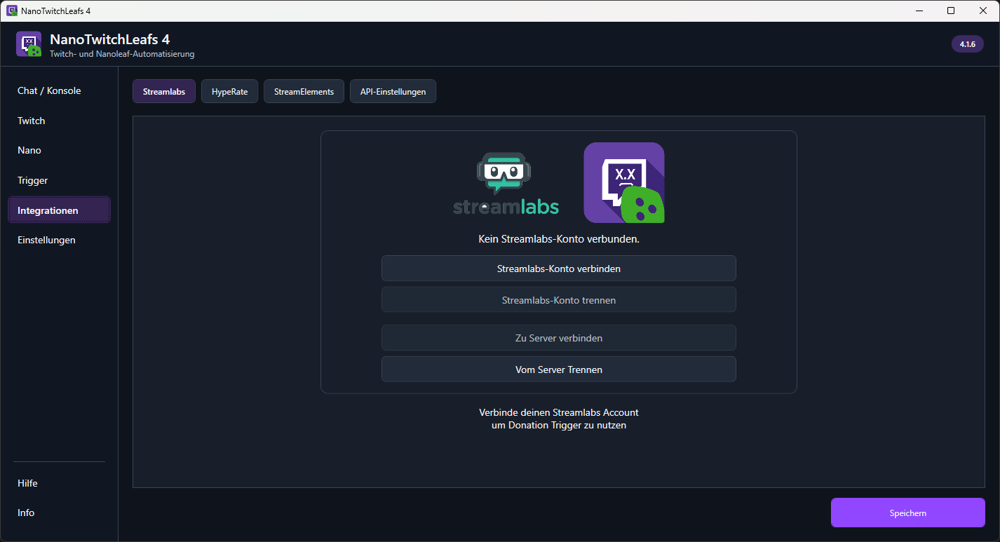 | 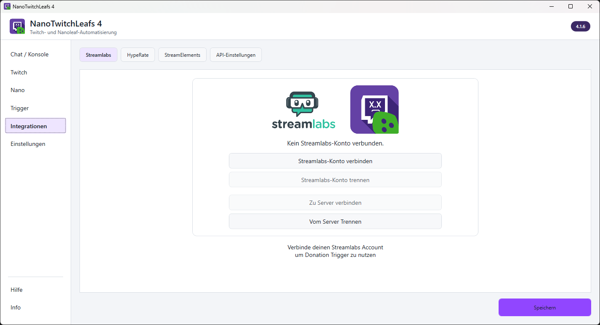 |
| Einstellungen | 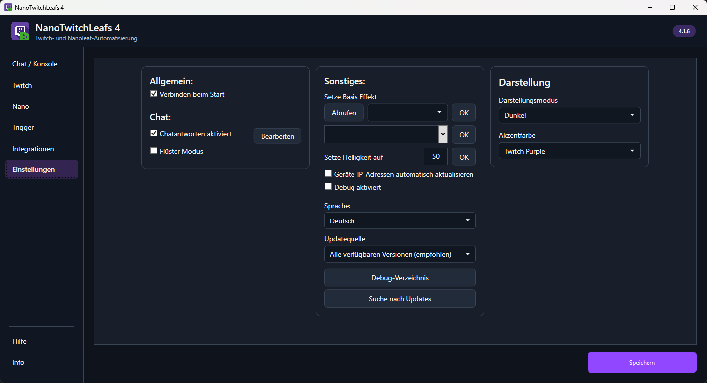 | 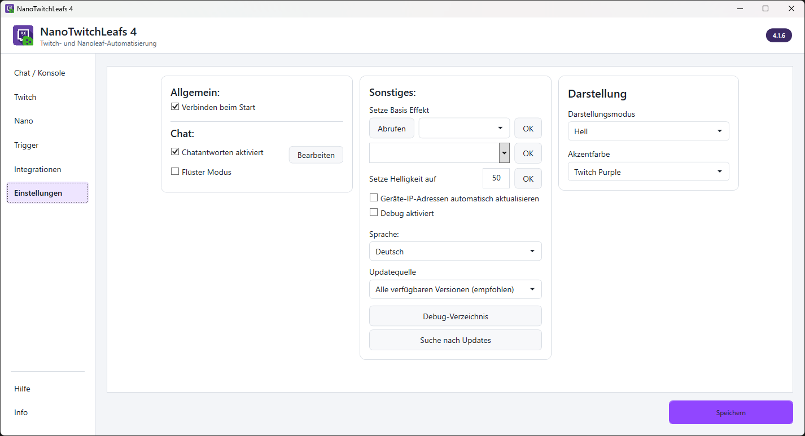 |
| Hilfe | 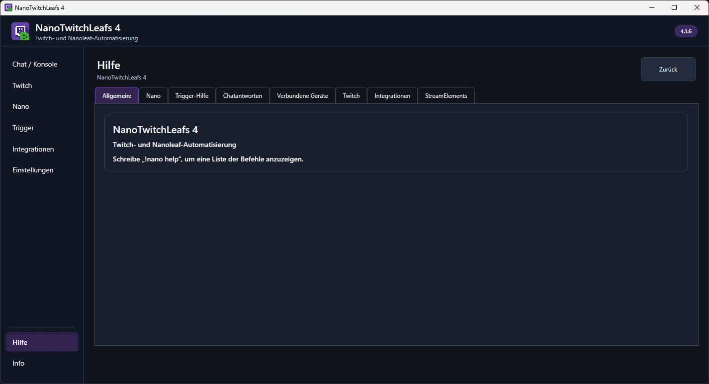 | 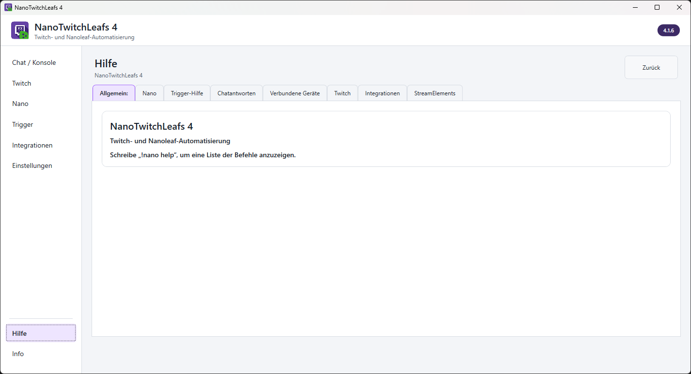 |
| Info | 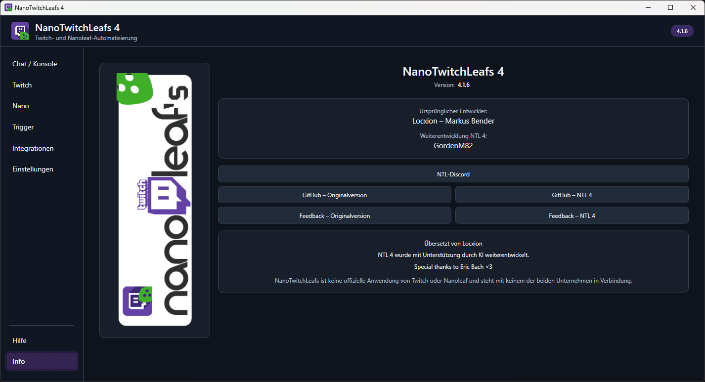 | 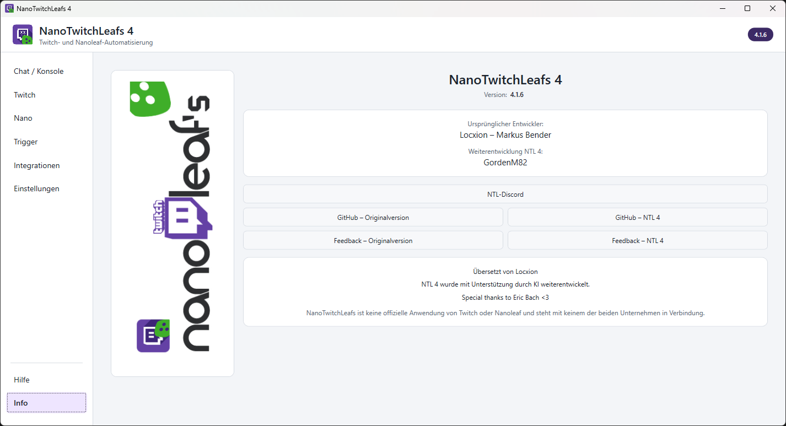 |

## English

The screenshots below show NanoTwitchLeafs 4 in dark and light mode. Personal details, local paths, channel names, and serial numbers have been redacted for publication. Device names remain visible only in the trigger screenshots so that selecting multiple target devices is apparent.

| View | Dark | Light |
| --- | --- | --- |
| Chat / Console |  |  |
| Twitch |  |  |
| Nanoleaf |  |  |
| Triggers |  |  |
| Integrations |  |  |
| Settings |  |  |
| Help |  |  |
| About |  |  |
